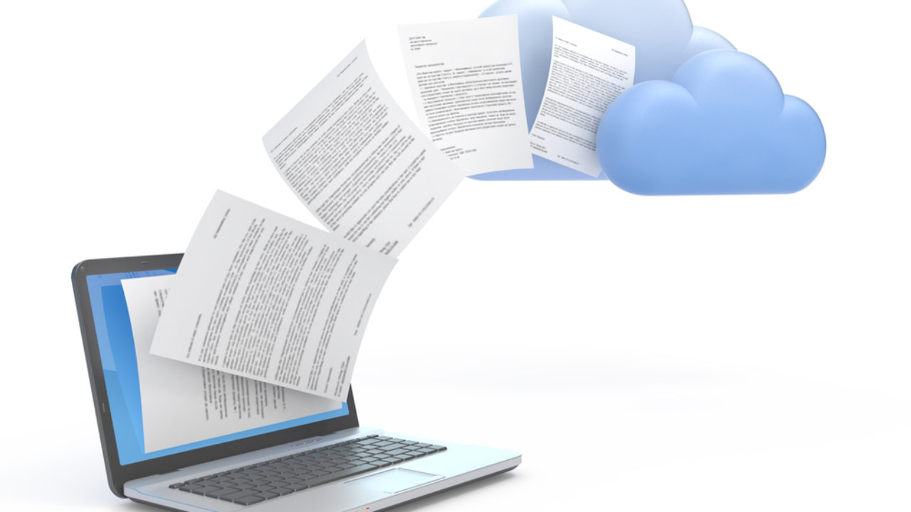

.. Copyright (c) 2020, Saksham Gupta
   Distributed under the terms of the MIT License.

   The full license is in the file LICENSE, distributed with this software.

Installation
============
Sample Documentation can be easily built using the procedure described in the following sections.
You can either use python virtual environment (venv) or Conda to build the documentation.

For Python Virtual Environment, navigate to :ref:`RST_VENV_INSTALL`.

For Conda, navigate to :ref:`RST_CONDA_INSTALL`.

First, clone the Sample_Cpp_Documentation repository using:

.. code::

    git clone https://github.com/sakshamgupta006/Sample_Cpp_Documentation.git

.. _RST_VENV_INSTALL:

Using Virtual Env
-----------------

Step:1 : Create a Virtual Environment
************************************

.. _RST_CONDA_INSTALL:

Using Conda
-----------

Step:2 : Create a Conda environment
***********************************
Please install `Conda <https://docs.conda.io/projects/conda/en/latest/user-guide/install/>`_ before following the next steps.
You can easily create a conda environment using:

.. code::

    conda create -n <NAME_OF_UR_ENV> python=3.7

Here, I am using python 3.7, but the documentation is compatible with all python 3 versions.

Example:

.. code::

    conda create -n cppdocs python=3.7

Step:2 : Install Required Libraries
***********************************
First activate the previously created conda environment:

.. code::

    conda activate <NAME_OF_UR_ENV>

Example:

.. code::

    conda activate cppdocs
